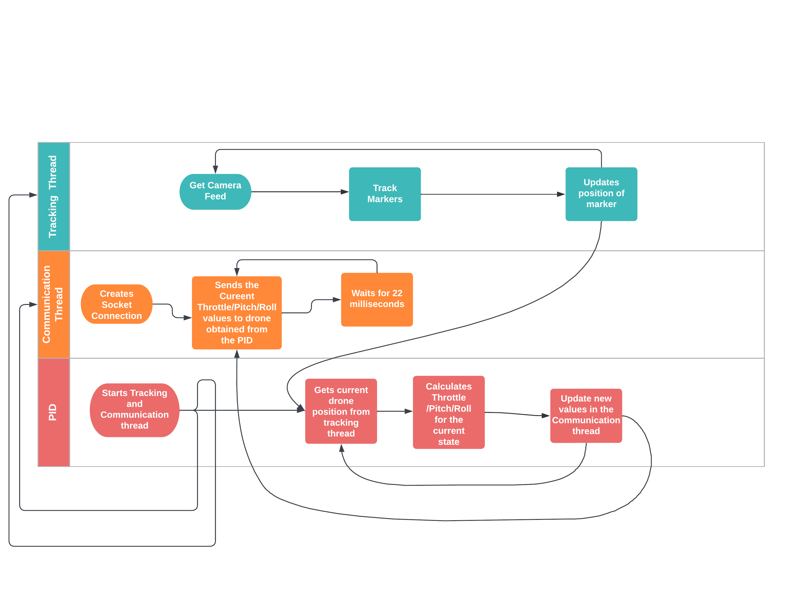
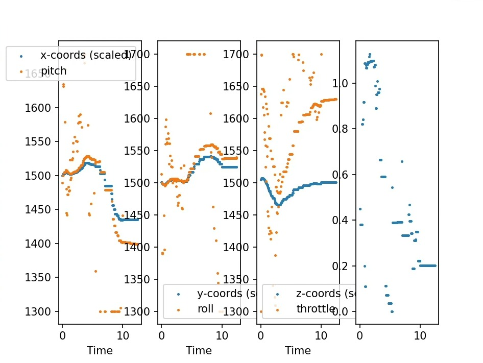
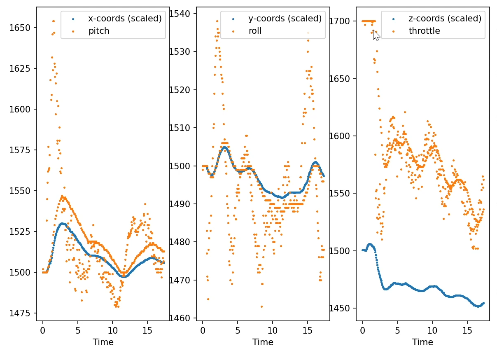
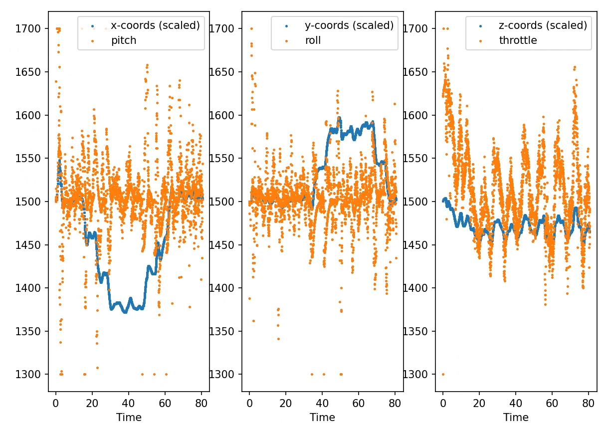

# Drona Aviation Pluto Drone Swarm Challenge
<br />

- :bookmark_tabs:  Click here to read the problem statement | [High_Drona.pdf](High_Drona.pdf)
- :bookmark_tabs:  Click here to read the report | [Final Submission Report19.pdf](Final_Submission_Report19.pdf)
- :blue_book: Click here for Published Python Package | [hp_da_pt19](https://pypi.org/project/hp-da-pt19/0.0.2/)
- :video_camera: Click here for Demonstration Video | [HP_DA_PT19.mp4](https://drive.google.com/file/d/1LZyAhv3IjZKZPWe01afDU9bwqY6L4ZgH/view?usp=share_link)
- :orange_book: Click here for presentation | [HP_DA_PT19.pptx](https://docs.google.com/presentation/d/1S01fg74Fwu1DsY1BKK37TKtEQkSChzMKpPDgEGJgY98/edit#slide=id.g2074c7dda5d_13_75)
<br />

## Overview
Drones are being developed for use in various applications like military, medical aid delivery, as an
emergency first responder, for surveillance, etc. They have four counter rotating propellers placed
on the same airframe. They are controlled by differential adjustment of the angular velocities of the
rotors. Drones can move freely in 3D space i.e.; they have 6 degrees of freedom (DOF). But they have
only 4 rotors (actuators) to control all 6 DOF. 
Thus, they are underactuated systems. Independent
control of 2 states namely x (forward/backward), y (right/left) translation is lost. These translations
are coupled with the Roll & Pitch angles.

**Drona Aviation Pluto 1.2** is an open-source programmable nano drone allows users to integrate with
external hardware. So, that we can program our drone to add multiple applications. The drone has
an onboard microcontroller that helps implement various algorithms to stabilize and fly the drone.
Its firmware is a modified version of the popular, open-source flight software, Cleanflight.
Our solution to this challenge comprises of various strategies for the control of this drone.
 
 Python wrapper for intraction with official Pluto Drone's firmware API. This package has following features:

**Task-1**

- [x] Implementation of control commands for the drone movements.(such as Pitch forward, Roll
left, take off - Land, etc.)

**Task-2**

- [x] Overhead camera calibration method
- [x] ArUCo tag detection and tracking
- [x] Pose estimation of the ArUCo tag
- [x] Implementation of PID for controlling drone
- [x] Drone Hovering
- [x] Drone movement in a rectangle of (1x2 meter)

**Task-3**

- [x] Drone Swarming in a rectangle of(1x2 meter)  

## Installation Using pip
```
pip install hp-da-pt19
```
For Linux distributions with both python2 and python3 (e.g. Debian, Ubuntu, ...) you need to run

```
pip3 install hp-da-pt19
```

## Installation in Developer Mode
Using the commands below you can install the repository in developer mode. This allows you to modify the library and use the modified version regularly.

```
git clone https://github.com/da-vidi21/HP_DA_PT19.git
cd HP_DA_PT19
pip install -e .
```
## Approach 


## File Structure
```
|-calibration_data
    |-calibration_matrix.npy
    |-distorsion_coefficients.npy
|-__init__.py
|-arucoTracking.py
|-calibration.py
|-Communication.py
|-pidaxischanged.py
|-rectangle.py
|-swarm.py
|-utils.py
```
## File Description
- **[calibration.py](hp_da_pt19/calibration.py)** :This file contains the code necessary for calibrating our camera. This step has several pre-requisites. we need to have a folder containing a set of checkerboard images taken using our camera. We have to make sure that these checkerboard images are of different poses and orientation. We need to provide the path to this directory and the size of the square in metres. We can also change the shape of the checkerboard pattern using the parameters given. We also have to make sure this matches with our checkerboard pattern. This code will generate two numpy files `calibration_matrix.npy` and `distortion_coefficients.npy`. These files are required to execute the next step that involves pose estimation. Note that the calibration and distortion numpy files given in this repository camera and its position specific.

    ```
    def calibrate(cam_src, frame_count, square_size, width, height, visualize=False):
    ```
    - Determines the camera matrix and the distortion coefficients from the image points.


- **[arucoTracking.py](hp_da_pt19/arucoTracking.py)** : This file contains the code that performs pose estimation and tracking after detecting the ArUCo markers. This is done in real-time for each frame obtained from the camera feed. We need to specify the path to the camera calibration matrix and distortion coefficients obtained from the previous step as well as the type for ArUCo marker we want to detect.
In our case we have used 4X4 ArUCo tag Dictionary.


    ```
    def start(self): 
    ```
    - Initiates the tracking thread.


    ```
    def read_position(self, id): 
    ```
    - Tracks the latest position of drone with given specific id and returns empty array if not detected.

    ```
    def read_smooth_position(self, id):
    ```
    - Returns the position of drone after applying smoothing.

    ```
    def read_z_rotation(self, id):
    ```
    - Returns the z rotation of the tag.

    ```
    def stop(self): 
    ```
    - Terminates the tracking thread

    ```
    def set_origin(self, origin):  
    ```
    - Sets the given passed coordinate as the orgin of the coordinate system.

    ```
    def update(self): 
    ```
    - For updating the position of the drone with the tracking data freceived from the latest frame.

    ```
    def generate_smooth_position(self, id):
    ```
    - For calculating the smoothed position of the drone.

    ```
    def moving_average(self, position_store):
    ```
    - Applies moving average to smooth out the coordinate values.

    ```
    def median_smoothing(self, position_store):
    ```
    - Applies median smoothing to smooth out the coordinate values.

    ```
    def get_velocity(self, id=0):
    ```
    - Returns the velocity of drone.


- **[Communication.py](hp_da_pt19/Communication.py)** : This file conatins the code that defines the drone's communication methods and the functions for controlling the drone movements and it's connection.This is done in real-time in a seperate thread.

    ```
    def __init__(self, IP_ADDRESS, PORT, id, debug=False):
    ```
    - Initializes the `Drone` object and sets base properties and values for it whenever the `Drone` object is created.

    ```
    def connect(self):
    ```
    - Starts the thread for `__com_thread `function.

    ```
    def disconnect(self):
    ```
    - Terminates the socket connection with the drone.

    ```
    def __com_thread(self):
    ```
    - Tries to establish a connection with the drone and launch the `__update()` function.

    ```
    def __update(self): 
    ```
    - Every 22nd millisecond delivers the most recent values of `rc_raw_data` and `set_cmd_data` to the drone.

    ```
    def __update_checksum(self):
    ```
    - Updates the checksum.

    ```
    def __get_LSB_MSB(self, val):
    ```
    - Returns the LSB and MSB values of the given input in range from 900(min) to 2100(max).

    ```
    def __set_rc_raw(self):
    ```
    - Sends the raw RC values like throttle, pitch, roll,etc to the drone.

    ```
    def set_cmd(self):
    ```
    - Sends commands to the drone for Take-off and Landing.

    ```
    def arm(self):
    ```
    - Modifies `rc_raw_data` in order to arm the drone.

    ```
    def disarm(self):
    ```
    - Modifies `rc_raw_data` in order to disarm the drone.

    ```
    def takeoff(self):
    ```
    - Modifies `rc_raw_data` in order to Take-off the drone.

    ```
    def land(self):
    ```
    -  Modifies `rc_raw_data` in order to land the drone.

    ```
    def set_throttle(self, val): 
    ```
    - Modifies `rc_raw_data` in order to change the throttle of the drone as per the input.

    ```
    def set_pitch(self, val): 
    ```
    - Modifies `rc_raw_data` in order to change the pitch of the drone as per the input.

    ```
    def set_roll(self, val): 
    ```
    - Modifies `rc_raw_data` in order to change the roll of the drone as per the input.

    ```
    def set_yaw(self, val):
    ```
    - Modifies `rc_raw_data` in order to change the yaw of the drone as per the input.

    ```
    def set_state(self, throttle, pitch, roll, yaw=1500):
    ```
    - Modifies the state values of the drone as per input and further modifies the `rc_raw_data` accordingly.

- **[pidaxischanged.py](hp_da_pt19/pidaxischanged.py)** :This file contains code for calculating the state values of the drone and clamping the state values according to the PID controller.

    ```
    def __init__(self, target_position, k_values, range):
    ```
    - Initialises the values and properties of the PID controller.
        - Coordinates of the target position are relative to the origin position.
        - Axis of the camera module is inverted with that of the drone axis.
    
    ```
    def calculate_state(self, current_position):
    ```
    - For calculating the state values as per the drone's `current_position`.

    ```
    def set_target(self, checkpoint):
    ```
    - Defines the target positon to the passed checkpoint.
        - Checkpoint is a list of form *[x,y,z]*.


    ```
    def get_error(self): 
    ```
    - Returns the current state error.

    ```
    def clamp_state_values(self):
    ```
    - Clamps the state values according to the input received in the range during initiation.

- **[rectangle.py](hp_da_pt19/rectangle.py)** :This file contains the code for the execution of task mentioned in `Task-2`, i.e. to hover the drone to a specific height and to move the drone in the rectangle of (1x2 meter). To run Task-2 connect to drone via Wi-Fi and then run this file.

    ```
    def visit_checkpoints(checkpoints, x_permissible_error=0.07, y_permissible_error=0.07, z_permissible_error=0.05, permissible_rms_velocity=0.05, id=0):
    ```
    - For the drone movement to the specific checkpoint.
        - Checkpoint format consists of *[x,y,z]* and the time alloted for it.
        - Further permissible error values in x,y,z and rms velocity has been provided.
        - `id=0` is the ID number of the associated ArUCo tag.

- **[utils.py](hp_da_pt19/utils.py)** : This file contains the code required for various utilities required for the functionalities.

    ```
    def aruco_display(corners, ids, rejected, image):
    ```
    - Computes and draws the center *$[x, y]$* coordinates of the ArUco

    ```
    def show_fps(output): 
    ```
    - Returns the frame rate in the tracking display.
    ```
    def print_coordinates(tvec): 
    ```
    - Returns the tracking coordinate.
    ```
    def plot(commands, coords, flight_duration, y="pitch", all=False):
    ```
    - Plots the tracking data(given by `pos_tracker`) and state values(given by PID controller).
    ```
    def plot_velo(velo_arr, flight_duration): 
    ```
    - Plots the velocity of the drone against time.

- **[swarm.py](hp_da_pt19/swarm.py)** : This file conatains the code required for operating the swarm of drones.
    ```
    def visitCheckpoints(checkpoints,drone,pos_tracker,pid,id):
    ```
    - For the movement of specific drone to the specific checkpoint.
        - Checkpoint format consists of *[x,y,z]* and the time alloted for it.
        - `id=0` is the ID number of the associated ArUCo tag.
    ```
    def nSwarm(checkpoints,ID,IPs):
    ```
    - For initiating a separate thread for the PID of each drone connected to the system.
    - *Note: The thread for tracking is same for all the drones.*

## Results



*Controller performance during hovering without tuning and smoothing applied.*<br>



*Controller performance during hovering with tuning and smoothing applied.*<br>



*Controller performance during hovering in a rectangle with tuning and smoothing applied.*<br>

## Team Members
- [Vidit Srivastava](https://github.com/vidit21srivastava)
- [Pratik Kubal](https://github.com/pratik-k-2002)
- [Indrayudh Ghosh](https://github.com/LightningItself)
- [Shlok Kumar Shaw](https://github.com/shlok-007)
- [Aniket Roy](https://github.com/AniketIXR)
- [Bhavya Garg](https://github.com/Bhavya-002)
- [Natasha Banerjee](https://github.com/Natasha19281)
- [Arin Dev](https://github.com/arin-dev)
- [Akash Kumar](https://github.com/SkyXen)
- [Akshath Choudhary](https://github.com/akshath3001)

## References

- https://in.mathworks.com/discovery/pid-control.html
- https://docs.python.org/3/library/socket.html
- http://www.multiwii.com/wiki/index.php?title=Multiwii_Serial_Protocol
 


## Citations
```
@article{article,
author = {Wibowo, Agung and Susanto, Erwin},
year = {2018},
month = {09},
pages = {81},
title = {Performance Improvement of Water Temperature Control using Anti-windup Proportional Integral Derivative},
journal = {Lontar Komputer : Jurnal Ilmiah Teknologi Informasi},
doi = {10.24843/LKJITI.2018.v09.i02.p03}
}
```
